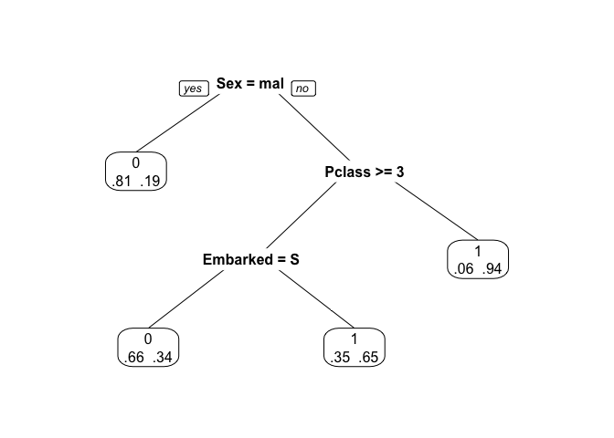

Titanic Survival: Comparing Decision Trees with Logistic Regression
================

This is a comparison of Titanic survival prediction accuracy using a Decision Tree or Logistic Regression. Decision trees have the disadvantage that they can't use continuous independent variables, so rather than binning numeric variables such as Age and Fare, I wanted to see how the simple tree compares with logistic regression with and without these continuous variables.

``` r
# load packages and data
library(rpart)
library(rpart.plot)
library(lme4)
```

    ## Loading required package: Matrix

``` r
library(magrittr)

#setwd("../input") # for loading data in Kaggle
data <- read.csv("train.csv")

# make output more clear later
#levels(data$Embarked) <- c("", "Cherbourg", "Queenstown", "Southampton")
```

First I'm randomly splitting 20% of the training data rows off for validation.

``` r
# Index data for training/validation split
n <- nrow(data)
set.seed(10)
idx.train <- sample(1:n, n * 0.8)
idx.val <- sample((1:n)[-idx.train])
```

### 1: Decision Tree (only categorical variables)

Now on to generate a simple decision tree, using the rpart package. We only look at categorical variables, and omit continuous columns (or arbitrary ones e.g. ticket numbers).

``` r
tree_cols <- c(3, 5, 7, 8, 12)
x_train <- data[idx.train, tree_cols]
x_val <- data[idx.val, tree_cols]
y_train <- data[idx.train, 2]
y_val <- data[idx.val, 2]

x <- cbind(x_train, y_train)

# grow tree 
fit_dt <- rpart(y_train ~ ., data = x, method="class")

# summarize and plot tree
print(fit_dt)
```

    ## n= 712 
    ## 
    ## node), split, n, loss, yval, (yprob)
    ##       * denotes terminal node
    ## 
    ##  1) root 712 275 0 (0.61376404 0.38623596)  
    ##    2) Sex=male 462  90 0 (0.80519481 0.19480519) *
    ##    3) Sex=female 250  65 1 (0.26000000 0.74000000)  
    ##      6) Pclass>=2.5 107  50 0 (0.53271028 0.46728972)  
    ##       12) Embarked=S 64  22 0 (0.65625000 0.34375000) *
    ##       13) Embarked=C,Q 43  15 1 (0.34883721 0.65116279) *
    ##      7) Pclass< 2.5 143   8 1 (0.05594406 0.94405594) *

``` r
prp(fit_dt, extra = 4)
```



Now we use the tree to predict survival in the set-aside validation set:

``` r
predicted_dt <- predict(fit_dt, x_val)
predicted_dt <- ifelse(predicted_dt[,1] <= 0.5, 1, 0) # reformat to binary

# calculate accuracy of prediction
acc_dt <- sum(predicted_dt == y_val, na.rm = 1) / length(y_val)
cat(paste0("Validation accuracy for the decision tree is ",
           round(acc_dt,3), 
           "."))
```

    ## Validation accuracy for the decision tree is 0.816.

### 2a: Logistic Regression (only categorical variables)

The same data is used to run a logistic regression. The output tells us which variables significantly impact survival (p-value under 0.05).

``` r
# fit logistic regression model
fit_lr <- glm(y_train ~ ., data = x, family = binomial(link = "logit"))
summary(fit_lr)
```

    ## 
    ## Call:
    ## glm(formula = y_train ~ ., family = binomial(link = "logit"), 
    ##     data = x)
    ## 
    ## Deviance Residuals: 
    ##     Min       1Q   Median       3Q      Max  
    ## -2.3728  -0.7153  -0.4872   0.6501   2.5772  
    ## 
    ## Coefficients:
    ##             Estimate Std. Error z value Pr(>|z|)    
    ## (Intercept)  14.4050   535.4112   0.027   0.9785    
    ## Pclass       -0.8389     0.1209  -6.937 4.01e-12 ***
    ## Sexmale      -2.6794     0.2194 -12.215  < 2e-16 ***
    ## SibSp        -0.2486     0.1161  -2.142   0.0322 *  
    ## Parch        -0.1091     0.1203  -0.907   0.3643    
    ## EmbarkedC   -10.8128   535.4113  -0.020   0.9839    
    ## EmbarkedQ   -11.1964   535.4113  -0.021   0.9833    
    ## EmbarkedS   -11.2803   535.4112  -0.021   0.9832    
    ## ---
    ## Signif. codes:  0 '***' 0.001 '**' 0.01 '*' 0.05 '.' 0.1 ' ' 1
    ## 
    ## (Dispersion parameter for binomial family taken to be 1)
    ## 
    ##     Null deviance: 949.86  on 711  degrees of freedom
    ## Residual deviance: 665.17  on 704  degrees of freedom
    ## AIC: 681.17
    ## 
    ## Number of Fisher Scoring iterations: 12

Let's see how accurate this model is:

``` r
pred_lr <- function(fit, valdata, valtargets, title = "fit") {
  predicted = predict(fit, valdata)
  predicted <- ifelse(predicted >= 0, 1, 0) # reformat to binary
  
  # calculate accuracy of prediction
  acc <- sum(predicted == valtargets, na.rm = 1) / length(valtargets)
  cat(paste0("Validation accuracy for the ", title, " is ",
  round(acc, 3),
  "."))
}

pred_lr(fit_lr, x_val, y_val, "category-only logistic regression")
```

    ## Validation accuracy for the category-only logistic regression is 0.81.

### 2b: Logistic Regression (including continuous variables)

Now we run the full logistic regression including the continuous variables. This requires dealing with some NAs in the raw data. We could omit these rows (more conservative approach), but let's instead enter the variable mean or the most common factor level. This is for practice, after all.

``` r
## Logistic regression w. all data incl. continuous ----------------------------
x_train_all <- data[idx.train, c(3, 5:8, 10, 12)] # still omits names and tickets
x_val_all <- data[idx.val, c(3, 5:8, 10, 12)]

# complete gaps in  data (could remove rows with NA, but decided to complete w. dummy data)
# function to replace NAs with column mean
NA2mean <- function(x) replace(x, is.na(x), mean(x, na.rm = TRUE))
NA2mean_df <- function(df){
  nums <- unlist(lapply(df, is.numeric)) # index numeric columns
  done <- replace(df, nums, lapply(df[, nums], NA2mean))
  return(done)
}

# function to fill empty character cells with most frequent factor
fill_facs <- function(df) {
  for (i in 1:ncol(df)) {
    levels(df[, i])[levels(df[, i]) == ""] <-
      names(which.max(table(df[, i])))
  }
  return(df)
}

# replace NAs with column mean and replace empty cells with most frequent factor
x_train_all %<>% NA2mean_df() %>% fill_facs()
x_val_all %<>% NA2mean_df() %>% fill_facs()

# paste together
x_all <- cbind(x_train_all, y_train)

# fit model
fit_lr_all <- glm(y_train ~ ., data = x_all, family = binomial(link = "logit"))
summary(fit_lr_all)
```

    ## 
    ## Call:
    ## glm(formula = y_train ~ ., family = binomial(link = "logit"), 
    ##     data = x_all)
    ## 
    ## Deviance Residuals: 
    ##     Min       1Q   Median       3Q      Max  
    ## -2.5119  -0.6076  -0.4361   0.6478   2.3714  
    ## 
    ## Coefficients:
    ##              Estimate Std. Error z value Pr(>|z|)    
    ## (Intercept)  4.619635   0.564877   8.178 2.88e-16 ***
    ## Pclass      -1.014854   0.152071  -6.674 2.50e-11 ***
    ## Sexmale     -2.651055   0.221710 -11.957  < 2e-16 ***
    ## Age         -0.036389   0.008452  -4.306 1.67e-05 ***
    ## SibSp       -0.331481   0.125955  -2.632  0.00849 ** 
    ## Parch       -0.138919   0.128262  -1.083  0.27877    
    ## Fare         0.001244   0.002444   0.509  0.61085    
    ## EmbarkedC    0.376867   0.268806   1.402  0.16091    
    ## EmbarkedQ    0.168047   0.364815   0.461  0.64506    
    ## ---
    ## Signif. codes:  0 '***' 0.001 '**' 0.01 '*' 0.05 '.' 0.1 ' ' 1
    ## 
    ## (Dispersion parameter for binomial family taken to be 1)
    ## 
    ##     Null deviance: 949.86  on 711  degrees of freedom
    ## Residual deviance: 644.99  on 703  degrees of freedom
    ## AIC: 662.99
    ## 
    ## Number of Fisher Scoring iterations: 5

Finally, we can see if how accurate this is:

``` r
pred_lr(fit_lr_all, x_val_all, y_val, "full logistic regression")
```

    ## Validation accuracy for the full logistic regression is 0.821.

Turns out here isn't much difference in accuracy between models. This is most likely due to the relative unimportance of age and ticket price for survival. If those variables had a larger impact, the full logistic regression should be the most accurate predictor.

### 2c: Logistic Regression with factorial interactions

Of course, a simple logistic regression model with only first order effects won't capture interactions between the variables, which the Decision Tree does to an extent. So now let's add interactions between the variables with the highest explanatory power. A bit backwards in terms of good practice, usually one would start with the more complex model and pare it down.

``` r
# fit model with interactions
fit_lr_fact <-
  glm(
  y_train ~ . + (Sex * Pclass) + (Sex * Embarked) + (Pclass * Embarked),
  data = x_all,
  family = binomial(link = "logit")
  )

summary(fit_lr_fact)
```

    ## 
    ## Call:
    ## glm(formula = y_train ~ . + (Sex * Pclass) + (Sex * Embarked) + 
    ##     (Pclass * Embarked), family = binomial(link = "logit"), data = x_all)
    ## 
    ## Deviance Residuals: 
    ##     Min       1Q   Median       3Q      Max  
    ## -3.3101  -0.6651  -0.4486   0.4724   2.3078  
    ## 
    ## Coefficients:
    ##                    Estimate Std. Error z value Pr(>|z|)    
    ## (Intercept)        8.249923   1.083366   7.615 2.64e-14 ***
    ## Pclass            -2.505751   0.371271  -6.749 1.49e-11 ***
    ## Sexmale           -6.910268   1.012466  -6.825 8.78e-12 ***
    ## Age               -0.038452   0.009085  -4.232 2.31e-05 ***
    ## SibSp             -0.303951   0.132518  -2.294   0.0218 *  
    ## Parch             -0.051382   0.137044  -0.375   0.7077    
    ## Fare               0.001410   0.002580   0.547   0.5846    
    ## EmbarkedC         -0.392425   1.000822  -0.392   0.6950    
    ## EmbarkedQ         -0.049760   5.307894  -0.009   0.9925    
    ## Pclass:Sexmale     1.808215   0.383638   4.713 2.44e-06 ***
    ## Sexmale:EmbarkedC  0.301914   0.632581   0.477   0.6332    
    ## Sexmale:EmbarkedQ -1.960342   0.907779  -2.159   0.0308 *  
    ## Pclass:EmbarkedC   0.304757   0.314233   0.970   0.3321    
    ## Pclass:EmbarkedQ   0.439533   1.777793   0.247   0.8047    
    ## ---
    ## Signif. codes:  0 '***' 0.001 '**' 0.01 '*' 0.05 '.' 0.1 ' ' 1
    ## 
    ## (Dispersion parameter for binomial family taken to be 1)
    ## 
    ##     Null deviance: 949.86  on 711  degrees of freedom
    ## Residual deviance: 612.08  on 698  degrees of freedom
    ## AIC: 640.08
    ## 
    ## Number of Fisher Scoring iterations: 6

Calculate prediction accuracy once again:

``` r
pred_lr(fit_lr_fact, x_val_all, y_val, "factorial logistic regression")
```

    ## Validation accuracy for the factorial logistic regression is 0.827.

Accuracy increases by a small amount.
